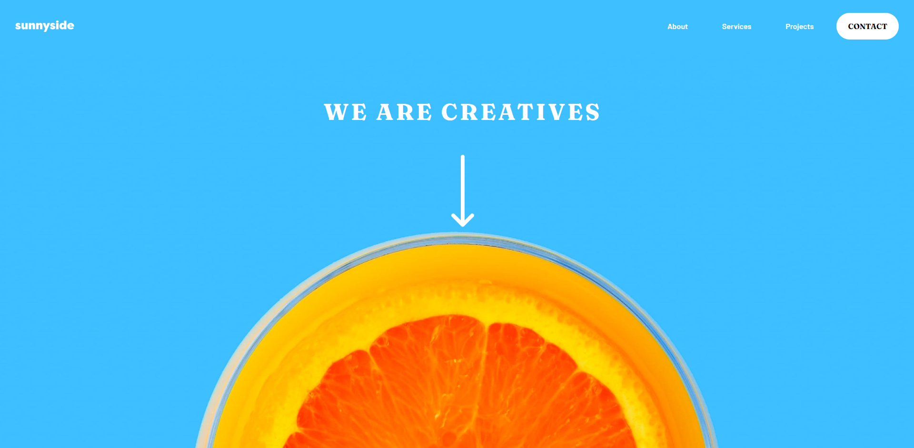

# Frontend Mentor - Sunnyside agency landing page solution

This is a solution to the [Sunnyside agency landing page challenge on Frontend Mentor](https://www.frontendmentor.io/challenges/sunnyside-agency-landing-page-7yVs3B6ef). Frontend Mentor challenges help you improve your coding skills by building realistic projects.

## Table of contents

- [Overview](#overview)
  - [The challenge](#the-challenge)
  - [Screenshot](#screenshot)
  - [Links](#links)
- [My process](#my-process)
  - [Built with](#built-with)
  - [What I learned](#what-i-learned)
  - [Continued development](#continued-development)
  - [Useful resources](#useful-resources)
- [Author](#author)
- [Acknowledgments](#acknowledgments)

## Overview

### The challenge

Users should be able to:

- View the optimal layout for the site depending on their device's screen size
- See hover states for all interactive elements on the page

### Screenshot



### Links

- Solution URL: [Add solution URL here](https://github.com/elian-dev/sunny-agency-landing-page)
- Live Site URL: [Add live site URL here](https://sunny-agency-landing-page-5p6b.vercel.app/)

## My process

### Built with

- Semantic HTML5 markup
- CSS custom properties
- Flexbox
- CSS Grid
- Mobile-first workflow
- [Astro](https://astro.build/) - Static files framework
- [SASS](https://sass-lang.com/) - For styles

### What I learned

I'm happy with the final result, my objective was to learn more about grid and in this project, I could apply it in various sections, furthermore, I learned how to apply animations and give good-looking micro-interactions to the users, and I learned how to import SVG inline in Astro I will put the code bellow how I achieved it.

```html
---
import logo from '/assets/images/logo.svg?raw'
---

<div class="logo">
  <Fragment set:html="{logo}" />
</div>
```

```css
.logo {
  svg path {
    fill: #fff;
  }
}
```

By doing that I could modify css properties of the SVG imported as color.

### Continued development

Areas to improve

- Stimating time

### Useful resources

- [Using SVGs as Astro components and inline CSS](https://ellodave.dev/blog/article/using-svgs-as-astro-components-and-inline-css/) - This helped me beacuse I was having troubles modifying the svg's properties.

## Author

- Website - [elian-dev](https://github.com/elian-dev)
- Frontend Mentor - [@elian-dev](https://www.frontendmentor.io/profile/elian-dev)

## Acknowledgments

This template is a boilerplate that we have created with the awesome team of JDK.
